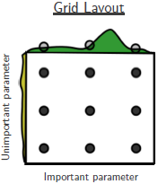
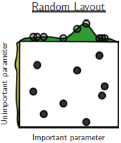

layout: false
class: middle, center, inverse

# 4.5 `dials`:<br><br>Tools for Creating Tuning Parameter Values

---

background-image: url(https://www.tidymodels.org/images/dials.png)
background-position: 97.5% 2.5%
background-size: 7%
layout: true

---

## 4.5 `dials`: Creating Hyperparameter Values

Most machine learning models require the user to predefine so-called **hyperparameters** (or *tuning parameters*) prior to model fitting. For example:
- **Linear regression:** -
- **Logistic regression:** -
- **Linear discriminant analysis:** -
- **Regularized regression:** `penalty`, `mixture`
- **Naïve bayes:** `Laplace`
- **k-nearest-neighbor:** `neighbors`, `weight_func`, `dist_power` 
- **CART:** `cost_complexity`, `tree_depth`, `min_n`
- **SVM:** `kernel`, `cost`, `degree`, `scale_factor`
- **Bagging:** `trees`, `min_n`
- **Random forest:** `trees`, `mtry`, `min_n`
- **Boosting:** `trees`, `mtry`, `min_n`, `tree_depth`, `learn_rate`

.footnote[
*Note: This list is not exhaustive! Depending on the underlying engine, an even broader set of hyperparameters can be specified. Use `args()` to inspect all hyperparameters (i.e. function arguments) available in a `parsnip` object.*
]

???
- hyperparameters cannot be learned from the data (which is why they differ from model coefficients/weights) -> they are external to model training
- NB: Laplace correction for smoothing low-frequency counts.
- CART: cost complexity for pruning as well as max tree depth, min_n for minimum number of data points to allow another split
- svm: scale_factor = gamma -> determines the influence of a single data point on the decision boundary
- boosting: learn_rate -> speed with which the boosted tree adapts to the fitted errors

---

## 4.5 `dials`: Creating Hyperparameter Values

`dials` streamlines the handling of hyperparameters. It provides functions for specifying parameter sequences and grids, introduces `parameters` objects that can be processed by the `parsnip` package, and ensures consistent parameter names.

--

In the context of a regularized regression, `penalty` and `mixture` are the two central hyperparameters. `dials` comes with a predefined `parameters` object for both.
.pull-left[
```{r}
mixture()
```
]
.pull-right[
```{r}
penalty()
```
```{r}
penalty(range = c(-10, 10))
```

]

???
- description of the hyperparameter
- indicator if the hyperparameter is quantitative or qualitative
- range of default parameter values
- scale (e.g., linear or logscale)

---

layout: false

## Excursus: Hyperparameter Scales

In practice, you will find that hyperparameters are often defined on the log instead of the linear scale, as for example seen on the previous slide:
- **`mixture()`:** $0.0, 0.1, 0.2, 0.3, 0.4, 0.5, 0.6, 0.7, 0.8, 0.9, 1.0$
- **`penalty()`:** $1e^{-10}, 1e^{-9}, 1e^{-8}, 1e^{-7}, 1e^{-6}, 1e^{-5}, 1e^{-4}, 1e^{-3}, 1e^{-2}, 1e^{-1}, 1e^{0}$

--

**Considerations for using the Log-Scale:**

1. If you have no clue regarding the optimal parameter value, you are inclined to evaluate a broad search space with relatively small but also relatively large candidate values (e.g., from $1e^{-10}$ to $1$). On a linear scale, this approach would ignore a large proportion of the relatively small search space. For example the region $[0, 0.1]$ on the linear scale includes almost all candidates from the log-scale.
2. For some models and hyperparameter sets, the model's accuracy is relatively insensitive to certain regions of the search space. Those models demand a large variation in order to observe any impact on the underlying performance metrics.

--

If you have identified a promising parameter subspace, you may eventually narrow it down by further restricting the search space of your hyperparameter grid.

???
- usually models do not behave linear in the hyperparameters (i.e. some are very sensitive on low regions and some are more sensitive in high regions)

---

background-image: url(https://www.tidymodels.org/images/dials.png)
background-position: 97.5% 2.5%
background-size: 7%
layout: true

---

## 4.5 `dials`: Creating Hyperparameter Values

There are various helper functions to query and specify the `parameters` objects. 

.panelset[
.panel[.panel-name[Parameter Ranges]
```{r}
penalty() %>% range_get()
```

```{r}
penalty(range = c(-10, 10)) %>% range_get()
```
]
.panel[.panel-name[Parameter Values]

```{r}
penalty() %>% value_sample(n = 5)
```

```{r}
penalty() %>% value_seq(n = 5, original = F)
```

```{r}
penalty() %>% value_set(seq(-10, 0, by = 2)) %>% value_seq(n = 5, original = F)
```
]
]

.pull-right[.footnote[
*Note: The same helper functions can be applied to qualitative hyperparameters, such as `weight_func()` in `nearest_neighbor()`.*
]]

???
- parameter values:
  - random draw with replacement
  - equally spaced sequence
  - equally spaced, customized sequence
- original: if it should return the values on original scale (log) or on the transformed scale

---

## 4.5 `dials`: Creating Hyperparameter Values

There are special cases where the concrete hyperparameter values depend on your data set, e.g., the `mtry` argument (number of randomly sampled predictors at each split) in `parsnip::rand_forest()`.
```{r}
mtry()
```

Therefore, we must `finalize()` the hyperparameter setup based on the training set.
```{r}
finalize(mtry(), x = train_set %>% select(-died))
```

---

## 4.5 `dials`: Creating Hyperparameter Values

Finally, `dials` renders the systematic querying and evaluation of multiple hyperparameters possible. There are various alternative search algorithms for finding the optimal hyperparameter combination.

.panelset[
.panel[.panel-name[Grid Search]
```{r, echo=F, out.width='25%', out.extra='style="float:right; padding:10px"'}

```
Identify the optimal hyperparameter combination from a predefined set of parameter values.
```{r}
grid_regular(
  mixture(), penalty(), 
  levels = c(5, 5)
) %>% glimpse
```
*Source: [Bergstra/Bengio (2012)](https://www.jmlr.org/papers/volume13/bergstra12a/bergstra12a)*
]
.panel[.panel-name[Random Search]
```{r, echo=F, out.width='25%', out.extra='style="float:right; padding:10px"'}

```
Identify the optimal hyperparameter combination by sampling from a predefined range of parameter values.
```{r}
grid_random(
  mixture(), penalty(),
  size = 25
) %>% glimpse
```
*Source: [Bergstra/Bengio (2012)](https://www.jmlr.org/papers/volume13/bergstra12a/bergstra12a)*

]
.panel[.panel-name[Iterative Search Methods]
Identify the optimal hyperparameter candidates by adapting the search procedure based on already evaluated values.
- **Model Racing:** Evaluate candidates after, for example, 50% of the training and discard all candidates which are significantly inferior to the current best candidate ([Kuhn/Silge, 2021](https://www.tmwr.org/grid-search.html#racing)).<br><br>
- **Bayesian Optimization:** Evaluate new candidates, for example, based on the regions of the search space with high uncertainty (*exploration*) or high expected improvement (*exploitation*) ([Agnihotri/Batra, 2020](https://distill.pub/2020/bayesian-optimization/)).<br><br>
- **Simulated Annealing:** Evaluate new, randomly sampled candidates that are in close proximity to the current best candidate. If the new candidate is superior, continue from there, otherwise return to current optimum ([Kuhn/Silge, 2021](https://www.tmwr.org/iterative-search.html#simulated-annealing)).
]
]

???
- Grid Search:
  - Pro: Easily understandable
  - Con: brute-force like method which is not really efficient (increase exponentially with the number of hyperparameters)
- Random Search:
  - Pro: Randomness can help to find global optimum
  - Con: Can produce overlapping candidates
- Racing: perform interim analysis
  - Pro: good for computationally expensive models (e.g., DNN, SVM)
  - Contra: interim t-tests inefficient for relatively efficient methods (e.g., tree-based models)
- SA: returning the previous best is more probably if new candidate is significantly weaker
  - Pro: good with very large number of tuning parameters due to random components

---

layout: false
class: middle, center, inverse

# 4.6 `tune`:<br><br>Tidy Tuning Tools

---

background-image: url(https://www.tidymodels.org/images/tune.png)
background-position: 97.5% 2.5%
background-size: 7%
layout: true

---

## 4.6 `tune`: Tidy Tuning Tools

The `tune` package unites the previous steps in the context of hyperparameter tuning with the `tune_grid()` function being the primary modeling workhorse.
```{r, eval=F}
tune_grid(
  object, preprocessor, resamples,
  grid = 10, metrics = NULL, control = control_grid()
)
```

.panelset[
.panel[.panel-name[Positional Arguments]
- `object`: either a `workflow` or a `model` object
- `preprocessor`: an additional preprocessing recipe or formula expression (only required in case a `model` object is provided)
- `resamples`: a `resamples` object (e.g., our `climbers_folds`)
]
.panel[.panel-name[Keyword Arguments]
- `grid`: the number of candidate hyperparameter combinations to be tried (defaults to `10` draws from a [Latin hypercube](https://en.wikipedia.org/wiki/Latin_hypercube_sampling)) respectively a predefined parameter grid
- `metrics`: a set of performance metrics (defaults to $RMSE$ and $R^2$ for regression and $AUC$ and *accuracy* for classification tasks) computed for each resample (customize via `yardstick::metric_set()`) 
- `control`: additional options to control the tuning process (e.g., `save_pred = T` to retain the predictions for each fold or `verbose = T` to print the log)

<br><br><br><br><br>

.footnote[
*Note: Retaining the predictions for each fold can impose a heavy burden on your machine's memory which may become unwieldy if your data set and/or the number of resamples is large.*
]
]
]

???
- latin hypercube: space-filling sample algorithm (divide search space into equal cubes, sample from cube)

---

## Tidymodels: A Complete Tuning Example

**Step 1:** Split data into training and test set using `rsample`.

As in the [previous example](#example-no-resampling).

**Step 2:** Create resamples of the training set for hyperparameter tuning using `rsample`.
```{r}
set.seed(2021)
climbers_folds <- training(climbers_split) %>% vfold_cv(v = 10, repeats = 1, strata = died) 
```

**Step 3:** Define the relevant preprocessing steps using `recipe`.

As in the [previous example](#example-no-resampling).

**Step 4:** Specify the desired machine learning model using `parsnip`. Indicate which hyperparameters are to be optimized by using the `tune()` placeholder.
```{r}
reg_log_cls <- logistic_reg() %>%
  set_args(penalty = tune(), mixture = tune()) %>% 
  set_mode("classification") %>% 
  set_engine("glmnet", family = "binomial")
```

.footnote[
*Note: Using the `tune()` placeholder, we could even tune hyperparameters that are part of our modeling recipes (e.g., `over_ratio` in `themis::step_upsample()` or `threshold` in `step_other`).*
]

???
- mixture determines how much of the LASSO vs. ridge penalty is included in the loss function

---

## Tidymodels: A Complete Tuning Example

**Step 5:** Bring everything together using `workflows`.
```{r}
cls_wf <- workflow() %>%
  add_recipe(rec) %>%
  add_model(reg_log_cls)
```

**Step 6:** Create a grid of hyperparameter candidates for performing a grid search.
```{r}
param_grid <- grid_regular(
  penalty(), mixture(),
  levels = c(10, 10)
)

param_grid %>% 
  glimpse
```

---

## Tidymodels: A Complete Tuning Example

**Step 7:** Perform hyperparameter tuning using `tune`.

`tune_grid()` iterates over all 10 folds included in `climbers_folds`, and evaluates all 100 candidate pairs for `mixture()` and `penalty()` in `param_grid`, resulting in 1,000 model fits.


```{r, echo=F, out.height='35%', out.width='35%', out.extra='style="float:right; padding: 30px"'}
knitr::include_graphics("https://tenor.com/view/mr-bean-waiting-still-waiting-gif-13052487.gif")
```

```{r, eval=F}
start <- Sys.time()

cls_wf_fit <- tune_grid(
  cls_wf, climbers_folds,
  grid = param_grid,
  metrics = metric_set(roc_auc, accuracy, sens, spec),
  control = control_grid(save_pred = T, verbose = T)
)

Sys.time() - start
```

```
> Time difference of 8.985842 mins
```

.footnote[
*Note: If we are not concerned with hyperparameter tuning per sé, but simply want to train a model without hyperparameters and obtain an unbiased performance estimate, we can refer to `fit_resamples()` which works almost identical to `tune_grid()` (except for the `grid` argument).*
]

---

## Excursus: Parallel Processing

**Problem:** Depending on your hardware, your dataset size, your model and the amount of hyperparameters to be optimized, the search process can take several minutes, hours or even days.

**Solution:** `tune` is equipped with distributed computing capabilities (which stem from an integration of the [`foreach` package](https://cran.r-project.org/web/packages/foreach/vignettes/foreach.html)). The tuning process allows for models to be trained independent of each other along multiple dimensions:
- parallelization across resamples,
- parallelization across hyperparameter candidates, or
- parallelization within ensemble models (e.g., random forest or boosted trees).

---

## Excursus: Parallel Processing

**Step 7a:** Check the number of available CPU cores.
```{r}
all_cores <- parallel::detectCores(logical = F)
all_cores
```

???
- **Physical cores** are number of physical cores, actual hardware components.
- **Logical cores** are the number of physical cores times the number of possible simultaneous processes.

--

**Step 7b:** Create a cluster of workers, i.e. `R` sessions run in parallel. In the background, `tune` divides your data (e.g., resamples) and distributes it across the available clusters.
```{r}
comp_cluster <- parallel::makeCluster(all_cores - 2)
comp_cluster
```

???
tip: its generally a good idea to not use all available clusters
  - oftentimes, performance increases are not linear but you get a rate of diminishing returns
  - the memory load is proportional as copies of your data are transferred to every core
  - you still want to be able to work on your computer while the computations are executed
  - there are scenarios in which parallel computing can even be detrimental (large dataset, simple model)

--

**Step 7c:** Register a backend for parallel computing (here the `doParallel` package). The backend handles the parallelization (e.g., load balancing ensures that cores are not "underemployed").
```{r}
doParallel::registerDoParallel(comp_cluster)
```

???
- there are different backends packages that you can use for parallel processing. They start with `do` and vary in the way of how they enable parallel processing.

---

## Excursus: Parallel Processing

**Step 7d:** Perform hyperparameter tuning in parallel using `tune`.

```{r, echo=F, out.height='35%', out.width='35%', out.extra='style="float:right; padding: 30px"'}
knitr::include_graphics("https://tenor.com/view/yay-traffic-car-race-gif-14739892.gif")
```

```{r, eval=F}
start <- Sys.time()

cls_wf_fit <- tune_grid(
  cls_wf, climbers_folds,
  grid = param_grid,
  metrics = metric_set(roc_auc, accuracy, sens, spec),
  control = control_grid(
    save_pred = T, verbose = T,
    allow_par = T, parallel_over = "resamples", pkgs = c('themis')
  )
)

Sys.time() - start
```
```
> Time difference of 3.706945 mins
```

.footnote[
*Note: By default, `tidymodels` copies only its core packages to all concurrently running `R` sessions. If you leverage additional packages (e.g., `themis`) as part of your modeling pipeline, it must be provided in the tuning controls.*
]

???
- as you can see the speed-up is not proportional but diminishing in the number of cores (also somewhat depending on what you are doing in the background)

---

```{r, echo=F}
cls_wf_fit <- read_rds("./slides/cls_wf_tuned.rds")
```

## 4.6 `tune`: Tidy Tuning Tools

`tune_grid()` updates your initial `climbers_folds` object by adding additional columns (`.metrics` and `.notes`, `.predictions` and others depending on your controls).
```{r}
cls_wf_fit
```

Now, there are several neat things we can do with our fitted `climbers_folds` data frame. Let's have a look at some convenience functions provided by the `tune` package.

???
- note that the resulting tibble does neither include the data (only the indexes) nor the fitted models, but only the performance metrics and predictions (usually we are not interested in the models themselves during resampling, but only in the optimal hyperparameter set)
- .notes captures warnings and errors that occur during execution to help you debugging (i.e. which model and fold potentially produced an error)
- most of the columns `tidymodels` creates have the "." prefix in order to not override initial columns

---

## 4.6 `tune`: Tidy Tuning Tools

.panelset[
.panel[.panel-name[collect_metrics()]
Extract performance metrics summarized across all resamples. Use `summarize = F` to obtain the unaggregated metrics for each resample.
```{r}
cls_wf_fit %>% collect_metrics(summarize = T)
```
]
.panel[.panel-name[show_best()]
Filter for the `n` best performing candidate pairs.
```{r}
cls_wf_fit %>% show_best(metric = "roc_auc", n = 3)
```
]
.panel[.panel-name[select_best()]
Extract the overall best performing candidate pair. Use `select_by_one_std_err(metric = "roc_auc")` to obtain the best candidate pair which still satisfies the 1-se-rule.
```{r}
cls_wf_fit %>% select_best(metric = "roc_auc")
```
]
.panel[.panel-name[collect_predictions()]
Extract the validation set predictions for each fold (only applicable if `save_pred = T` in the controls).
```{r}
cls_wf_fit %>% 
  collect_predictions(
    summarize = F, parameters = select_best(cls_wf_fit, metric = "roc_auc")
  )
```
]
]

???
Collect Metrics:
- 4 metrics * 1,000 models
- the set of collect functions do all the unnesting for you

---

## 4.6 `tune`: Tidy Tuning Tools

```{r, fig.width=10, fig.asp=0.618, fig.retina=3, fig.align='center'}
autoplot(cls_wf_fit)
```

???
- note sens-spec-trade off
- note that model is very insensitive towards small penalty values
- note that accuracy is clearly a crude measure of model performance here as for higher penalty values the model does not predict the negative class any longer

---

## Tidymodels: A Complete Tuning Example (cont.)

**Step 8:** Finalize the `workflow` object.
```{r, results='hide'}
cls_wf_final <- cls_wf %>% 
  finalize_workflow(select_best(cls_wf_fit, metric = "roc_auc"))

cls_wf_final
```
```
>  Output on next slide
```

.footnote[
*Note: Would we not have combined our model specification and preprocessing recipe in a `workflow` object, we could alternatively use `finalize_model()` or `finalize_recipe()`.*
]

---

## Tidymodels: A Complete Tuning Example (cont.)

```
> == Workflow ===================================================================================
> Preprocessor: Recipe
> Model: logistic_reg()
> 
> -- Preprocessor -------------------------------------------------------------------------------
> 5 Recipe Steps
> * step_medianimpute()   * step_dummy()
> * step_normalize()      * step_smote()
> * step_other()
> 
> -- Model --------------------------------------------------------------------------------------
> Logistic Regression Model Specification (classification)
> 
> Main Arguments:
>   penalty = 0.00599484250318942
>   mixture = 0.111111111111111
> 
> Engine-Specific Arguments:
>   family = binomial
> 
> Computational engine: glmnet 
```

---

## Tidymodels: A Complete Tuning Example (cont.)

**Step 9:** Perform the final fit by training the model on the whole training data and predict the unseen observations from the test data.
```{r, eval=F}
cls_wf_final %>% 
  fit(data = train_set) %>% 
  predict(new_data = test_set, type = "prob")
```

--

<br>

**Shortcut:** The previous step can be abbreviated by using `last_fit()`. Conveniently, it also computes performance metrics along the way.
```{r, warning=F, message=F}
cls_wf_last_fit <- cls_wf_final %>% 
  last_fit(split = climbers_split, metrics = metric_set(roc_auc, accuracy, sens, spec))

cls_wf_last_fit
```

---

## 4.6 `tune`: Tidy Tuning Tools

We have now successfully tuned a single machine learning model! `r emo::ji("hugs")` `r emo::ji("star_struck")` Eventually, however, we would like multiple models to compete on a given task and choose the winner. `r emo::ji("1st_place_medal")`

<br>

--

**Practical Tips for Model Selection ([Kuhn/Johnson (2013), p. 79](http://appliedpredictivemodeling.com/)):** 
1. Start with very flexible *black-box* models (e.g., boosted trees or SVM) to produce an optimal benchmark (*performance ceiling*).<br><br>
2. Evaluate slightly less opaque models which provide a baseline degree of interpretability (e.g., PLS, PCA or regularized regression).<br><br>
3. Try out a parsimonious *white-box* model (e.g., linear regression or CART) and investigate if it can reasonably approximate the performance ceiling.

.footnote[
_Note: For a comprehensive overview of the topic of **interpretable ML** check out [Mulner (2021)](https://christophm.github.io/interpretable-ml-book/)._
]

???
- your goal is to find the simplest possible model with reasonable performance
