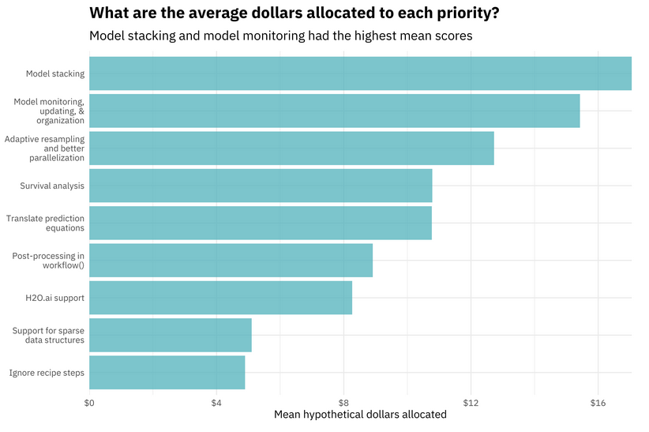

```{r setup, include = FALSE}
knitr::opts_chunk$set(
  #set comment formatting
  comment = ">",
  #collapse code and output
  collapse = F
)
```

```{r packages, warning=F, message=F, echo=F}
#install.packages("pacman")
if (!require("pacman")) install.packages("pacman")
pacman::p_load(xaringanthemer, tidyverse, tidymodels, showtext, glmnet, doParallel, usemodels)
pacman::p_load_gh("hadley/emo")
```

```{r xaringan-themer, include=FALSE, warning=FALSE}
style_mono_accent(
  base_color = "#000000",
  link_color = "#0000EE",
  header_font_google = google_font("Josefin Sans"),
  text_font_google   = google_font("Montserrat", "700b", "400"),
  code_font_google   = google_font("Fira Mono"),
  colors = c(
    red = "#f34213",
    white = "#FFFFFF"
  ),
  code_font_size = "smaller",
  code_inline_background_color = "#F4F4F4",
  outfile = "./custom/xaringan-themer.css"
)
```

name: agenda

## Agenda

**1 Learning Objectives**

**2 Introduction to `tidymodels`**

**3 Himalayan Climbing Expeditions Data**

**4 The Core `tidymodels` Packages**

>4.1 `rsample`: General Resampling Infrastructure  
4.2 `recipes`: Preprocessing Tools to Create Design Matrices  
4.3 `parsnip`: A Common API to Modeling and Analysis Functions  
4.4 `workflows`: Modeling Workflows  
4.5 `dials`: Tools for Creating Tuning Parameter Values  
4.6 `tune`: Tidy Tuning Tools  
4.7 `broom`: Convert Statistical Objects into Tidy Tibbles  
4.8 `yardstick`: Tidy Characterizations of Model Performance

**5 Additions to the `tidymodels` Ecosystem**

---

## 1 Learning Objectives `r emo::ji("idea")`

This workshop introduces `tidymodels`, a unified framework towards modeling in `R` using tidy data principles. You will get to know tools that facilitate every step of your machine learning workflow, from resampling, over feature engineering and model building, to model tuning and performance evaluation.

More specifically, after this workshop you will
- be familiar with the core packages of the `tidymodels` ecosystem and hopefully realize the value of a unified modeling framework,<br><br>
- know how to design a full-fledged machine learning pipeline for a particular prediction task,<br><br>
- broaden your technical skill set by learning about declarative programming, hyperparameter scales and parallel processing, and<br><br>
- most importantly, be capable of conducting your own machine learning projects in `R`.

---

```{r child='./01_intro.Rmd', eval=T}
```

---

```{r child='./02_resampling.Rmd', eval=T}
```

---

```{r child='./03_preprocessing.Rmd', eval=T}
```

---

```{r child='./04_model_building.Rmd', eval=T}
```

---

layout: false
class: center, middle

# 5-Minute Break<br><br>`r emo::ji("coffee")` `r emo::ji("doughnut")`

---

```{r child='./05_workflows.Rmd', eval=T}
```

---

```{r child='./06_tuning.Rmd', eval=T}
```

---

```{r child='./07_model_evaluation.Rmd', eval=T}
```

---

## 5 Additions to the `tidymodels` Ecosystem

Similar to the `tidyverse` ecosystem, there is already a promising supply of complementary packages that further improve the capabilities of `tidymodels`:
.pull-left[

- `textrecipes`: Extra recipes for text processing<br><br>
- `themis`: Extra recipes steps for dealing with unbalanced data<br><br>
- `baguette`: Efficient model functions for bagging<br><br>
- `stacks`: Tidy model stacking<br><br>
- `probably`: Tools for post-processing class probability estimates<br><br>
- `usemodels`: Boilerplate code for `tidymodels` analyses<br><br>
- many, many more
]
.pull-right[
```{r, echo=F, fig.align='center'}
knitr::include_graphics("https://tenor.com/view/shocked-po-kung-fu-panda-gif-4255877.gif")
```
]

???
- textrecipes as extension to the recipes package
- baguette as add-on to the parsnip package
- probably enables the identification of optimal probability thresholds and equivocal zones (uncertain probability regions)
- themis extends recipes package
- vip provides interpretability techniques, e.g., importance weights, PDP, SHAPley-values
- stacking: ensemble technique to integrate the predictions of multiple models into a meta-model

---

## 5 Additions to the `tidymodels` Ecosystem

```{r, results='hide'}
library(usemodels)
use_glmnet(died ~ ., data = climbers_df, verbose = F, prefix = "glmnet_mod")
```
```
> glmnet_mod_recipe <- 
>   recipe(formula = died ~ ., data = climbers_df) %>% 
>   step_novel(all_nominal(), -all_outcomes()) %>% 
>   step_dummy(all_nominal(), -all_outcomes()) %>% 
>   step_zv(all_predictors()) %>% 
>   step_normalize(all_predictors(), -all_nominal()) 
> 
> glmnet_mod_spec <- 
>   logistic_reg(penalty = tune(), mixture = tune()) %>% 
>   set_mode("classification") %>% 
>   set_engine("glmnet") 
> 
> glmnet_mod_workflow <- 
>   workflow() %>% 
>   add_recipe(glmnet_mod_recipe) %>% 
>   add_model(glmnet_mod_spec) 
```

???
- recipe template contains minimal required steps
- `verbose = T` adds some additional commons for why some of the feature engineering steps are included

---

## 5 Additions to the `tidymodels` Ecosystem

*continued:*
```
> glmnet_mod_grid <- tidyr::crossing(penalty = 10^seq(-6, -1, length.out = 20), 
>     mixture = c(0.05, 0.2, 0.4, 0.6, 0.8, 1)) 
> 
> glmnet_mod_tune <- 
>   tune_grid(glmnet_mod_workflow, resamples = stop("add your rsample object"), 
>     grid = glmnet_mod_grid) 
```
<br><br>
`usemodels` ships with boilerplate code for several model types:
```{r}
ls("package:usemodels", pattern = "use_")
```

???
- proposed tuning grid might not be the best for your specific use case
- the template urges the user to manually specify the resampling method

---

## 5 Additions to the `tidymodels` Ecosystem

```{r, echo=F, out.height='65%', out.width='65%', fig.align='center'}

```

.footnote[*Source: [RStudio blog](https://connect.rstudioservices.com/tidymodels-priorities-survey/README.html)*]

---

## Thank You!

.pull-left[
`r emo::ji("thinking_face")` **Right now**<br><br>
```{r, echo=F, fig.align='center'}
knitr::include_graphics("https://tenor.com/view/homer-daydreaming-thinking-simpsons-gif-8949118.gif")
```
]
.pull-right[
`r emo::ji("nerd_face")` **After having mastered `tidymodels`**<br><br>
```{r, echo=F, fig.align='center'}
knitr::include_graphics("https://tenor.com/view/homer-gif-10571731.gif")
```
]

---

## Thank You!

```{r, echo=F, fig.align='center'}

```

*Source: [deeplearning.ai](https://www.linkedin.com/posts/deeplearningai_aifun-activity-6602264745171136512-QIwE)*


---

name: references

## References

[1]: 

[2]: Kuhn, M./Johnson, K. (2013): Applied Predictive Modeling. Chapter 3 (Data Pre-processing). Springer: New York 2013.

[3]: https://christophm.github.io/interpretable-ml-book/

---

## Further Resources

https://www.youtube.com/watch?v=9f6t5vaNyEM&t=2188s

https://www.tidymodels.org/learn/

https://www.tmwr.org/index.html

tidytuesday julia silge

https://www.tmwr.org/ 

???
convert online presentation to pdf:

docker run --rm -t -v %cd%/desktop/l09_desktop/workshops/02_tidyverse/slides:/slides astefanutti/decktape https://simonschoe.github.io/Introduction-to-the-Tidyverse/#1 index.pdf
